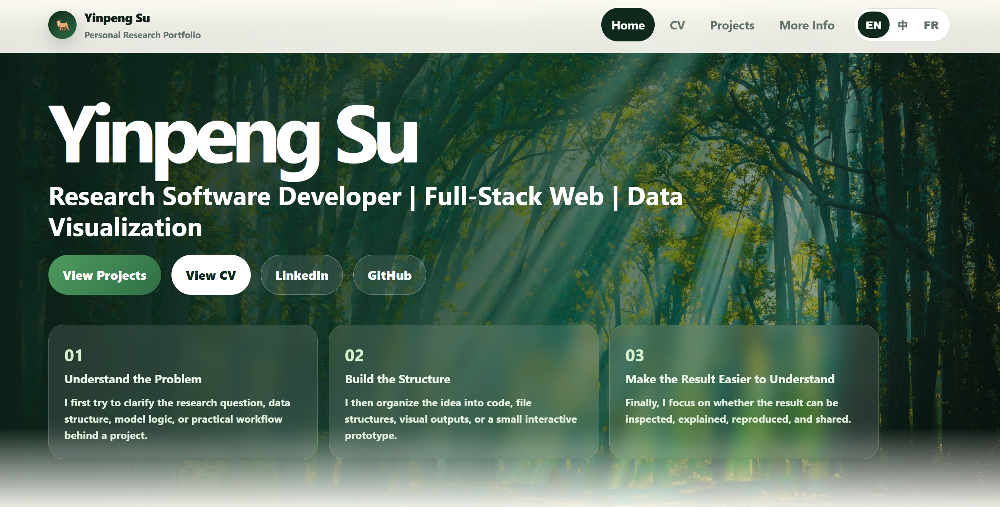
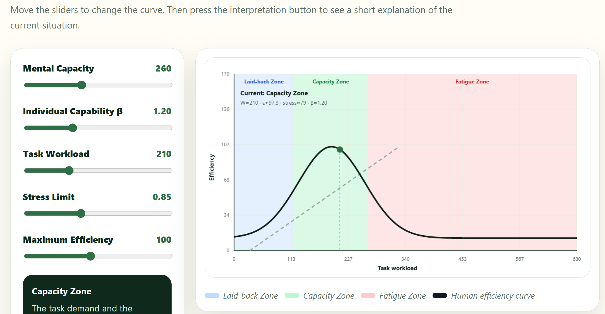

# Yinpeng Su — Research Software & Data Visualization Portfolio

This is my personal portfolio website for showing technical research work in a more readable form: not only code, but also the process of turning data, models, simulation outputs, and project notes into clear visual interfaces.

The site is static, trilingual, and GitHub Pages ready. It uses a forest/deer visual style because I like that atmosphere — calm, natural, and a little easier to remember than a plain resume page.



## Live site

After GitHub Pages is enabled, the site should be available here:

```text
https://YinpengSu-Concordia.github.io/YinpengSu-Portfolio/
```

Public links used on the website:

- LinkedIn: <https://www.linkedin.com/in/yinpeng-su-4626a0369/>
- GitHub: <https://github.com/YinpengSu-Concordia>

For privacy reasons, this public version does not display my direct email address or phone number. Those can be shared through formal CV attachments or direct communication when appropriate.

## What this website is for

This website is meant to give a quick but grounded view of my technical background:

- research software development
- Python simulation and model implementation
- data analysis and preprocessing
- web-based visualization
- interactive project explanation
- technical writing and project documentation

## Suggested viewing route

I recommend this route:

1. **Home** — who I am, how I organize technical work, and a little personal context.
2. **CV** — education, research experience, technical skills, and selected projects.
3. **Projects** — the WorkLord Toolbox project, including an interactive browser demo and figures generated by the Python toolbox.

## Pages

| Page | File | Purpose |
|---|---|---|
| Home | `index.html` | Personal introduction, work style, about section, and public links |
| CV | `cv.html` | Technical research CV focused on research software, data analysis, simulation, and visualization |
| Projects | `projects.html` | WorkLord Toolbox overview, interactive demo, figure gallery, code architecture, and reflection |

The website supports:

```text
English / 中文 / Français
```

## WorkLord Toolbox preview

The main project shown in this portfolio is **WorkLord Toolbox**, a Python-based simulation and visualization project related to mental workload, performance zones, and human–autonomy teaming.



The web demo is a simplified explanation layer. The full replication, computation, and figure generation are implemented in the Python toolbox.

### What the demo tries to explain

The interactive demo separates several ideas that are easy to mix together:

| Variable | Meaning in plain language |
|---|---|
| `Task Workload` | How demanding the task is: complexity, time pressure, information load, and operational burden |
| `Mental Capacity` | The current upper limit of mental resources available to handle the task |
| `β` | An individual capability parameter for this type of task; the same math problem can be hard for an elementary school student but easy for a university student |
| `Stress Limit` | The boundary before stress, fatigue, or overload becomes more visible |
| `Maximum Efficiency` | The highest efficiency reachable under favorable conditions in the simplified visualization |

The **Interpret This Scenario** button gives a plain-language explanation of the current state: whether the simulated person is closer to a laid-back, capacity, or fatigue zone.

## Project structure

```text
YinpengSu-Portfolio/
├── index.html
├── cv.html
├── projects.html
├── README.md
├── FINAL_PUBLIC_SITE_NOTES.md
├── .nojekyll
├── data/
│   └── project_metadata.json
├── docs/
│   └── readme-assets/
│       ├── portfolio-cover.png
│       └── worklord-preview.png
└── assets/
    ├── css/
    │   └── style.css
    ├── js/
    │   └── main.js
    ├── images/
    │   ├── hero-forest.jpg
    │   ├── deer-forest.jpg
    │   └── research-talk.jpg
    └── figures/
        ├── beta-variation-1.png
        ├── capacity-zone-beta-1.png
        ├── capacity-zone-beta-2.png
        ├── efficiency-time-beta-1-wt10000.png
        ├── efficiency-time-beta-3-wt9750.png
        └── stress-time-beta-1-wt10000.png
```

## How to open locally

Option 1 — direct open:

```text
Double-click index.html
```

Option 2 — VS Code:

```text
Open folder → YinpengSu-Portfolio → Live Server
```

No backend, database, build step, package manager, or external CDN is required.

## How to deploy with GitHub Pages

1. Create a public repository named:

```text
YinpengSu-Portfolio
```

2. Upload all files in this folder to the repository root.

3. Go to:

```text
Settings → Pages
```

4. Choose:

```text
Deploy from a branch
```

5. Select:

```text
main / root
```

6. Save and wait for GitHub Pages to publish the site.

Expected URL:

```text
https://YinpengSu-Concordia.github.io/YinpengSu-Portfolio/
```

## How to update the site later

Most text and translation content is managed through:

```text
assets/js/main.js
```

Main visual styling is in:

```text
assets/css/style.css
```

To update images, replace files in:

```text
assets/images/
assets/figures/
docs/readme-assets/
```

When changing file names, update the corresponding paths in the HTML or README.

## Notes on authorship and credit

WorkLord-related theoretical ideas are connected to the original research context and theory work by **Mengting Zhao, Dongyu Qiu, and Yong Zeng**.

This portfolio presents my own work in replication, organization, simulation tooling, visualization, and web-based explanation of the project.

The goal is not to claim the original theory as mine. The goal is to show how I can study a model, organize code, generate figures, and make the result easier to inspect and discuss.

## 中文简要说明

这是我的个人研究型作品集网站，主要展示研究软件、数据分析、仿真、交互式可视化和项目说明能力。网站支持英文、中文和法语，可以直接本地打开

如果你正在查看这个仓库，推荐顺序是：

```text
Home → CV → Projects
```

其中 Projects 页面包含 WorkLord Toolbox 的交互式演示和 Python 工具箱生成的图表。
